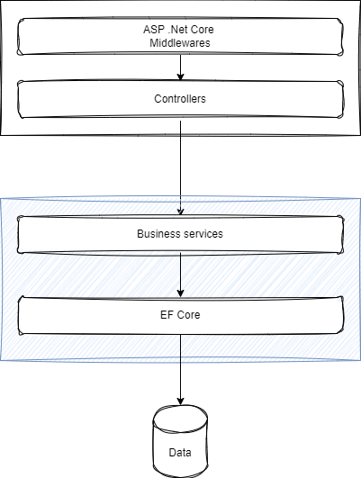

# The Assignment

This is a coding exercise that is not very complicated. You should take your time to get to know the code. The solution is made up of three different projects:

- CodeExercise: This project is an ASP .Net Core Web API, which includes all the controllers and web interfaces.
- CodeExercise.Business: This project holds all of the business logic, data models, and data transfer objects. It also has all of the infrastructure classes. If you need to look for code that accesses the data store, this is the place to do it.
- CodeExercise.Tests: This project is for unit and integration tests.



# Tasks

Using the solution and projects provided in this repository perform the following tasks:

## Task 1: Implement ContactService Interface

Implement the two methods of [IContactService](/CodeExercise.Business/Services/IContactService.cs) interface in [ContactService](/CodeExercise.Business/Services/ContactService.cs). You can use [DepartmentService](/CodeExercise.Business/Services/DepartmentService.cs) as an example of how to implement a business service. You should use [AddressBookDbContext](/CodeExercise.Business/Models/AddressBookDbContext.cs) for all data access operations.

- The `CreateContacts` method takes in an IEnumerable of `CreateContactDto` objects. For every contact in the input list, this method creates a new contact and stores it in the data store. It is important to note that this method checks for null input to avoid any issues. Additionally, it's essential that each contact contains an email address. As a result, the method ensures that the email field is not null or empty. If there is invalid data, the business logic should throw a [ValidationException](/CodeExercise.Business/Services/ValidationException.cs).
  
- `GetContactsByLastName(string lastName)`: This method will return a list of contacts filtered by last name.

After, implementation please run the unit tests and ensure that all unit tests in [ContactServiceTests](/CodeExercise.Tests/ContactServiceTests.cs) are passing.

## Task 2: API endpoints implementation

### Part 1 - Implement Contact Controller Create endpoint.

```csharp

[HttpPost("")]
[Consumes(MediaTypeNames.Text.Plain)]
public async Task<IActionResult> Create([FromBody] string commaSeparatedInput)
{
    ...
}

```
You need to finish implementing the "Create" endpoint in the [ContactController](/CodeExercise/Controllers/ContactController.cs). This endpoint takes plain text as input, which consists of multiple lines of comma-separated contact information. Every line after the first line contains data for a single contact. Example:

```

FirstName,LastName,Email
John,Doe,jdoe@mail.test
Julia,Dalton,sdalton@mail.test
Joseph,Langa,jlanga@mail.test

```
Your implementation should:

- parse the input (`commaSeparatedInput`)
- ignore the first line containing headers
- split each row to create a `CreateContactDto` object
- call your implemenation of `IContactService.CreateContacts` to store the contacts.
- ensure that each contact that will be saved have an email address that is not null or empty string.

You can safely assume that the input data will NOT have special characters that you need to escape.

## Part 2 - Create Get contacts by last name endpoint

Your task is to create a new API endpoint within the ContactController that will return a filtered list of contacts based on their last name. The last name to be used as the filter will be provided as a parameter to the API.

To implement this endpoint, you should call the `IContactService.GetContactsByLastName` method, which will filter the list of contacts by last name.

After your implementation please ensure that all unit tests are passing.